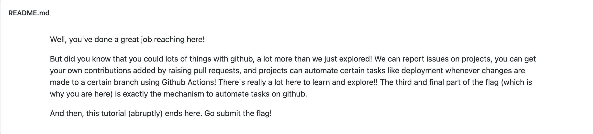

# Task1

Click the link on the page to redirect to branch 'develop'.

Change to branch 'some' and you would find something.md:

The first portion of flag is: SHA-256

Switch to commit : c30cecb
In folder2, you would find file.md

The second portion of flag is: main

Switch to fork by: ssl-team-aas. You would find folder/README.md.

The third portion of flag is: workflow

Flag: shamainworkflow